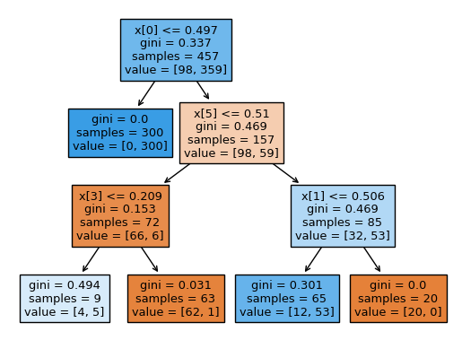

# ROOT: Rashomon Set of Optimal Trees for Characterizing Underrepresented Populations
Randomized controlled trials (RCTs) serve as the cornerstone for understanding causal effects, yet extending inferences to target populations presents challenges due to effect heterogeneity and underrepresentation. Our paper addresses the critical issue of identifying and characterizing underrepresented subgroups in RCTs, proposing a novel framework for refining target populations to improve generalizability. We introduce an optimization-based approach, Rashomon Set of Optimal Trees (ROOT), to characterize underrepresented groups. ROOT optimizes the target subpopulation distribution by minimizing the variance of the target average treatment effect estimate, ensuring more precise treatment effect estimations. Notably, ROOT generates interpretable characteristics of the underrepresented population, aiding researchers in effective communication. 

### Importing Necessary Libraries / Packages


```python
import numpy as np
import pandas as pd
import matplotlib.pyplot as plt
import seaborn as sns
import warnings
import sklearn.tree as tree

warnings.filterwarnings("ignore")

%load_ext jupyter_black
```


<script type="application/javascript" id="jupyter_black">
(function() {
    if (window.IPython === undefined) {
        return
    }
    var msg = "WARNING: it looks like you might have loaded " +
        "jupyter_black in a non-lab notebook with " +
        "`is_lab=True`. Please double check, and if " +
        "loading with `%load_ext` please review the README!"
    console.log(msg)
    alert(msg)
})()
</script>


## Generating Synthetic Data for Example


```python
import dgp

df, Y = dgp.get_data(n=1000, seed=0)
outcome = "Yobs"
treatment = "T"
sample = "S"
```

## Running ROOT (forest) 
Our approach takes as the input a combine dataframe of experimental and target sample units, name of the outcome, treatment and sample indicator, and hyperparameters. Ideally, larger the number of trees, the better the performance. However, there is time and performance tradeoff as the number of trees increases. 


```python
import ROOT

D_rash, D_forest, w_forest, rashomon_set, f, testing_data = ROOT.forest_opt(
    data=df,
    outcome=outcome,
    treatment=treatment,
    sample=sample,
    leaf_proba=1,
    num_trees=3000,
    vote_threshold=2 / 5,
)
```

    Fold 0
    Fold 1
    Fold 2
    Fold 3
    Fold 4
    ATE Est: 1.2211
    leaf    0.500000
    X0      0.156484
    X1      0.105682
    X2      0.018238
    X3      0.044944
    X4      0.019970
    X5      0.058912
    X6      0.030142
    X7      0.054766
    X8      0.001075
    X9      0.009787
    dtype: float64


### Plotting the Characteristic Tree
The units in the Orange Leaves are underrepresented and the units in the Blue leaves are well-represented in the RCT.


```python
tree.plot_tree(f, filled=True)
```


    [Text(0.375, 0.875, 'x[0] <= 0.497\ngini = 0.337\nsamples = 457\nvalue = [98, 359]'),
     Text(0.25, 0.625, 'gini = 0.0\nsamples = 300\nvalue = [0, 300]'),
     Text(0.5, 0.625, 'x[5] <= 0.51\ngini = 0.469\nsamples = 157\nvalue = [98, 59]'),
     Text(0.25, 0.375, 'x[3] <= 0.209\ngini = 0.153\nsamples = 72\nvalue = [66, 6]'),
     Text(0.125, 0.125, 'gini = 0.494\nsamples = 9\nvalue = [4, 5]'),
     Text(0.375, 0.125, 'gini = 0.031\nsamples = 63\nvalue = [62, 1]'),
     Text(0.75, 0.375, 'x[1] <= 0.506\ngini = 0.469\nsamples = 85\nvalue = [32, 53]'),
     Text(0.625, 0.125, 'gini = 0.301\nsamples = 65\nvalue = [12, 53]'),
     Text(0.875, 0.125, 'gini = 0.0\nsamples = 20\nvalue = [20, 0]')]


    

    


## Getting the refined Experimental Data for Further Analysis


```python
df_exp = df.loc[df["S"] == 1]
df_exp["w"] = f.predict(df_exp[[col for col in df_exp.columns if "X" in col]])

df_exp_refined = df_exp.loc[(df_exp["w"] == 1)]
df_exp_refined.describe().round(2)
```


<div>
<style scoped>
    .dataframe tbody tr th:only-of-type {
        vertical-align: middle;
    }

    .dataframe tbody tr th {
        vertical-align: top;
    }

    .dataframe thead th {
        text-align: right;
    }
</style>
<table border="1" class="dataframe">
  <thead>
    <tr style="text-align: right;">
      <th></th>
      <th>X0</th>
      <th>X1</th>
      <th>X2</th>
      <th>X3</th>
      <th>X4</th>
      <th>X5</th>
      <th>X6</th>
      <th>X7</th>
      <th>X8</th>
      <th>X9</th>
      <th>Yobs</th>
      <th>S</th>
      <th>T</th>
      <th>w</th>
    </tr>
  </thead>
  <tbody>
    <tr>
      <th>count</th>
      <td>377.00</td>
      <td>377.00</td>
      <td>377.00</td>
      <td>377.00</td>
      <td>377.00</td>
      <td>377.00</td>
      <td>377.00</td>
      <td>377.00</td>
      <td>377.00</td>
      <td>377.00</td>
      <td>377.00</td>
      <td>377.0</td>
      <td>377.00</td>
      <td>377.0</td>
    </tr>
    <tr>
      <th>mean</th>
      <td>0.34</td>
      <td>0.45</td>
      <td>0.50</td>
      <td>0.47</td>
      <td>0.52</td>
      <td>0.53</td>
      <td>0.48</td>
      <td>0.48</td>
      <td>0.52</td>
      <td>0.49</td>
      <td>14.11</td>
      <td>1.0</td>
      <td>0.51</td>
      <td>1.0</td>
    </tr>
    <tr>
      <th>std</th>
      <td>0.25</td>
      <td>0.27</td>
      <td>0.28</td>
      <td>0.29</td>
      <td>0.29</td>
      <td>0.29</td>
      <td>0.29</td>
      <td>0.29</td>
      <td>0.28</td>
      <td>0.28</td>
      <td>4.96</td>
      <td>0.0</td>
      <td>0.50</td>
      <td>0.0</td>
    </tr>
    <tr>
      <th>min</th>
      <td>0.00</td>
      <td>0.00</td>
      <td>0.00</td>
      <td>0.00</td>
      <td>0.00</td>
      <td>0.00</td>
      <td>0.00</td>
      <td>0.00</td>
      <td>0.00</td>
      <td>0.00</td>
      <td>2.37</td>
      <td>1.0</td>
      <td>0.00</td>
      <td>1.0</td>
    </tr>
    <tr>
      <th>25%</th>
      <td>0.14</td>
      <td>0.21</td>
      <td>0.25</td>
      <td>0.20</td>
      <td>0.26</td>
      <td>0.29</td>
      <td>0.23</td>
      <td>0.22</td>
      <td>0.27</td>
      <td>0.25</td>
      <td>10.40</td>
      <td>1.0</td>
      <td>0.00</td>
      <td>1.0</td>
    </tr>
    <tr>
      <th>50%</th>
      <td>0.30</td>
      <td>0.43</td>
      <td>0.50</td>
      <td>0.46</td>
      <td>0.56</td>
      <td>0.56</td>
      <td>0.48</td>
      <td>0.50</td>
      <td>0.53</td>
      <td>0.50</td>
      <td>13.98</td>
      <td>1.0</td>
      <td>1.00</td>
      <td>1.0</td>
    </tr>
    <tr>
      <th>75%</th>
      <td>0.47</td>
      <td>0.66</td>
      <td>0.73</td>
      <td>0.71</td>
      <td>0.75</td>
      <td>0.78</td>
      <td>0.71</td>
      <td>0.72</td>
      <td>0.75</td>
      <td>0.72</td>
      <td>17.51</td>
      <td>1.0</td>
      <td>1.00</td>
      <td>1.0</td>
    </tr>
    <tr>
      <th>max</th>
      <td>0.98</td>
      <td>1.00</td>
      <td>1.00</td>
      <td>1.00</td>
      <td>1.00</td>
      <td>1.00</td>
      <td>1.00</td>
      <td>0.99</td>
      <td>1.00</td>
      <td>1.00</td>
      <td>27.01</td>
      <td>1.0</td>
      <td>1.00</td>
      <td>1.0</td>
    </tr>
  </tbody>
</table>
</div>


```python

```
